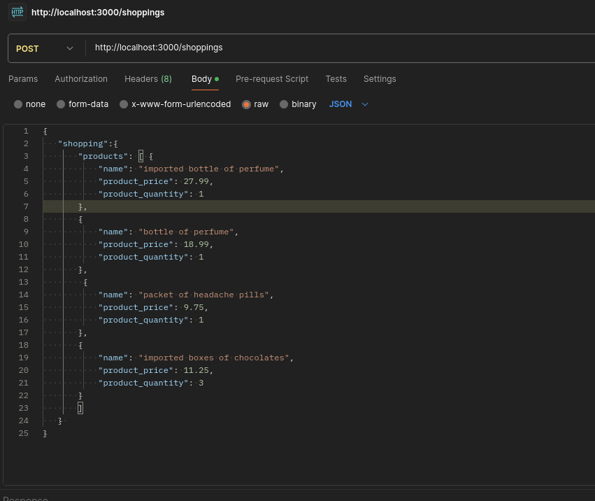

# README

Rails API to calculate products taxes in a shopping.

* **System dependencies**

	-- `ruby 3.3.1`

	-- `Rails 7.1.3.2`

	-- `(PostgreSQL) 14.11`
	
* **Configuration**
	-- Install [ruby](https://www.ruby-lang.org/pt/) 
	-- install [rails](https://rubyonrails.org/)
* **Database creation**
 -- `rails db:create`
 -- `rails db:migrate`

* **Database initialization**
	-- `rails db:seed`
  
* **How to run the test suite**
-- `rails test`

* ***Notes***
	-- You need to be able to send some request to API at [localhost](http://localhost:3000/shoppings)
	-- There is a file to help to test the API in `utils/help.txt` there we have the web request to copy-paste
* ***API DOC***

	-- `products` (object ARRAY)
	-- `name`(STRING)
	--`product_price`(FLOAT)
	-- `product_quantity`(INTEGER)